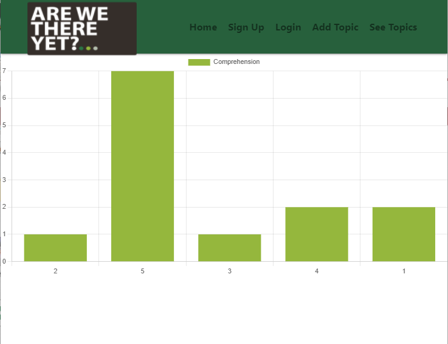

# ARE WE THERE YET?

  ## Description
  A full stack React app designed for instructors in the digital classroom to gauge the comprehension of their students in an anonymous fashion, in real time.

  ## Table of Contents

  * [Live Link](#live)
  * [Screenshot](#screenshot)
  * [Contributors](#contributors)
     
     

  ## Live
  [Deployed on Heroku](https://a-w-t-y.herokuapp.com/)
     
     

  ## Screenshot
  
     
     
  ## Contributors
  github: 
    devontehillman  
    chappand  
    colemilwee  
    ampieschke  

  